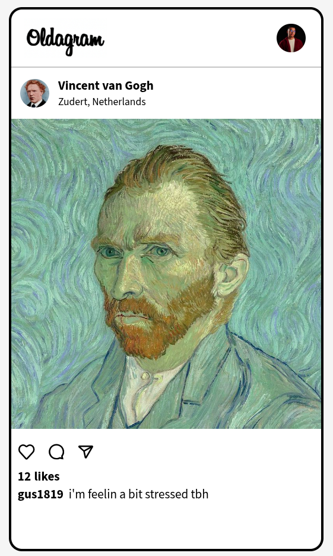

# Instagram-like Art Gallery

A responsive web application that displays famous artists' profiles in an Instagram-like interface, featuring artwork posts, like functionality, and keyboard navigation.



## Features

- **Artist Profiles**: View profiles of Vincent van Gogh, Gustave Courbet, and Joseph Ducreux
- **Interactive Posts**: Like functionality with visual feedback
- **Keyboard Navigation**: Use arrow keys to navigate between posts
- **Responsive Design**: Fixed-size container with clean Instagram-like UI
- **Hover Effects**: Interactive elements with subtle animations
- **Custom Styling**: Clean, modern design with rounded corners and consistent spacing

## Technologies Used

- HTML5
- CSS3 (Flexbox, custom properties)
- JavaScript (DOM manipulation, event listeners)
- Google Fonts (Source Sans 3)
- Ion Icons

## Project Structure
```
project-root/
├── index.html          # Main HTML structure
├── index.css           # All styling rules
├── index.js            # JavaScript functionality
├── images/             # Folder containing all project images
│   ├── logo.png
│   ├── user-avatar.png
│   ├── avatar-vangogh.jpg
│   ├── post-vangogh.jpg
│   ├── avatar-courbet.jpg
│   ├── post-courbet.jpg
│   ├── avatar-ducreux.jpg
│   ├── post-ducreux.jpg
│   ├── like.svg
│   ├── comment.svg
│   └── share.svg
└── README.md           # This documentation file
```
## Key Functionality

### JavaScript Features
1. **Post Navigation**: 
   - Use left/right arrow keys to cycle through posts
   - Smooth content transitions
   
2. **Like Functionality**:
   - Click the heart icon to like/unlike a post
   - Real-time like counter updates
   - Visual feedback with color change and scaling

### CSS Features
1. **Responsive Layout**:
   - Centered main container
   - Fixed dimensions (475px × 825px) with border radius

2. **Interactive Elements**:
   - Hover effects on profile pictures and icons
   - Visual feedback for clicked icons
   - Smooth transitions for all interactive elements

3. **Custom Styling**:
   - Instagram-like header with logo and user avatar
   - Clean post layout with user info, image, and reactions
   - Consistent spacing and typography

## How to Use

1. Clone the repository or download the project files
2. Open `index.html` in a web browser
3. Navigate between posts using the left/right arrow keys
4. Like/unlike posts by clicking the heart icon
5. View artist information and comments

## Customization

You can easily modify the project by:

1. Adding more artists to the `posts` array in `index.js`
2. Changing the styling in `index.css`
3. Updating the images in the `images` folder
4. Adjusting the container size in the CSS

## Dependencies

- Google Fonts: [Source Sans 3](https://fonts.google.com/specimen/Source+Sans+3)
- Ion Icons: [Ionicons](https://ionicons.com/)

## Browser Support

The project is compatible with all modern browsers including:
- Google Chrome
- Mozilla Firefox
- Microsoft Edge
- Safari

## License

This project is licensed under the MIT License - see the [LICENSE](LICENSE) file for details.